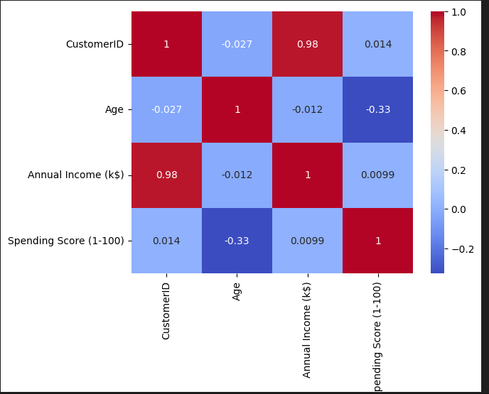
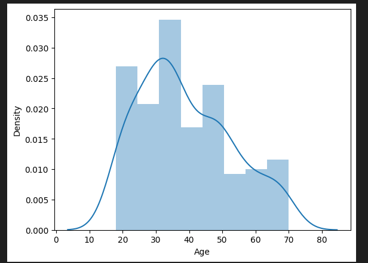
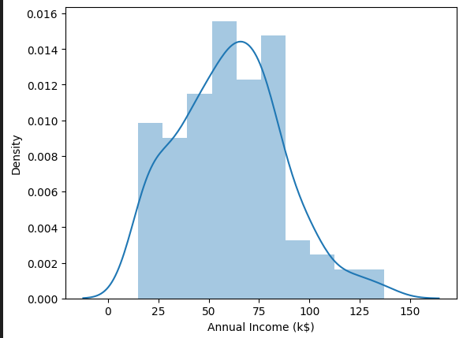
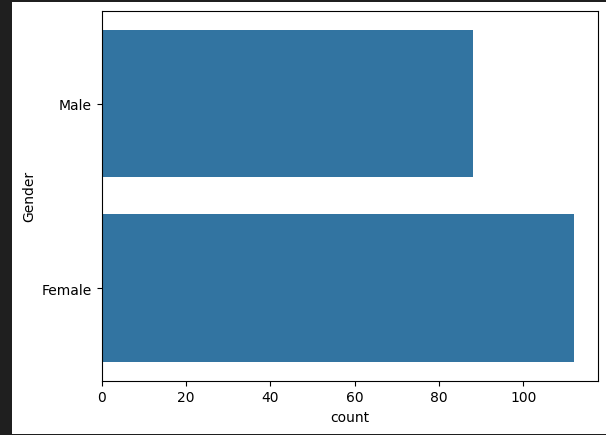
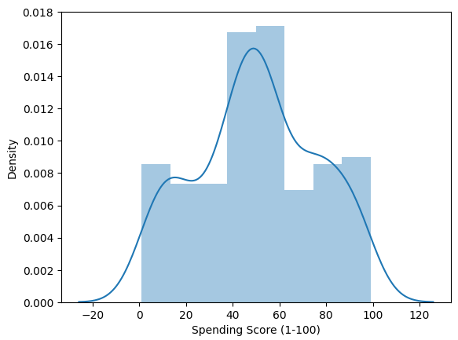
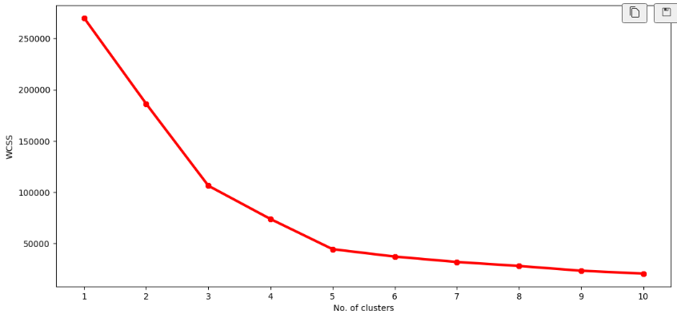
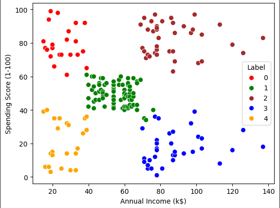
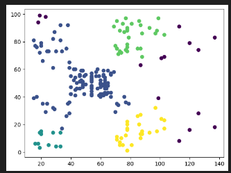
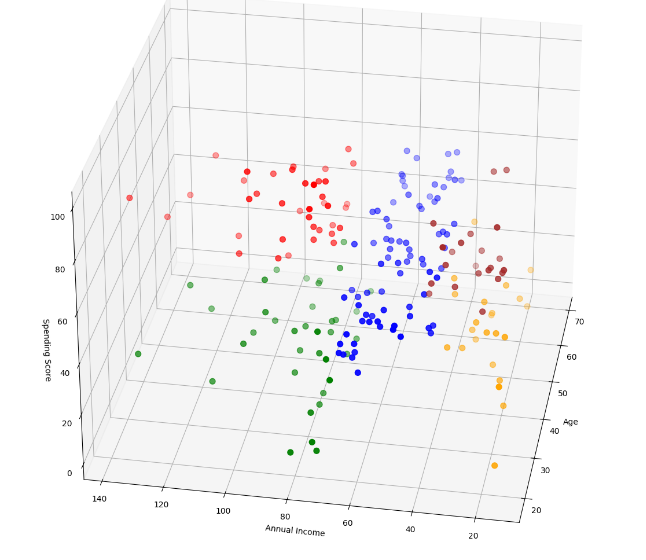

# 📊 Mall Customer Segmentation

## 📝 Project Overview
This project aims to segment customers based on their **spending patterns and income levels** using **K-Means Clustering**. The insights can help businesses target customers effectively and personalize marketing strategies.

## 🔧 Technologies Used
- Python 🐍
- Pandas & NumPy (Data Handling)
- Matplotlib & Seaborn (Visualization)
- Scikit-Learn (Clustering & Model Building)

## 📂 Dataset
The dataset contains **Customer IDs, Gender, Age, Annual Income, and Spending Score**. 

## 📌 Steps Followed
1. **Data Exploration & Cleaning**
2. **EDA (Exploratory Data Analysis)** 📊
3. **Finding Optimal Clusters (Elbow Method & Silhouette Score)** 📈
4. **Applying K-Means Clustering** 🔄
5. **Visualizing Customer Segments** 🎨

## 📊 ## Exploratory Data Analysis
### 1. Correlation Heatmap 

- This heatmap shows the correlation between numerical features.  
- Values close to **1** (red) indicate strong positive correlation, while values near **-1** (blue) indicate strong negative correlation.  
- If the correlation between features is very high (>0.9), consider **removing one** to avoid multicollinearity.  
- Features with low correlation to the target variable may be **less relevant** for prediction.  

---

### 2. Age Distribution 
- This plot likely shows the **age distribution** of individuals in your dataset.  
- If the distribution is **skewed** (e.g., right-skewed), it means there are more younger individuals.  
- If it’s **normally distributed**, age is spread evenly across the population.  
- Outliers (extreme values) can be observed at the lower and higher ends of the age spectrum.  

---

### 3. Annual Income Distribution 
- This plot shows the spread of **income levels** in the dataset.  
- If it’s **bimodal**, it suggests two distinct income groups.  
- A **right-skewed distribution** indicates that most people earn lower salaries, with fewer high-income earners.  
- Identifying **outliers** (extremely high or low incomes) may be useful for filtering anomalies.  

---


### 4. Gender Distribution 
- This is likely a **bar plot** showing the count of males and females in the dataset.  
- If there's a significant gender imbalance, it could affect clustering outcomes (bias in segmentation).  
- If gender is categorical, you can analyze its impact on clustering.  

---

## 5. Spending Score Distribution



### Interpretation:
- The histogram with KDE (Kernel Density Estimation) overlay shows the distribution of **Spending Scores (1-100)**.
- The data follows a **bimodal distribution**, indicating two peaks around **40-50** and **70-80**, suggesting distinct customer groups.
- There are no significant outliers, but a few values **slightly exceed the 100 limit**, which might need further investigation.
- The distribution helps in **identifying spending behavior patterns** and segmenting customers effectively.

- ### Elbow and clustering methods

### 6. K-Means Elbow Method 
- The elbow method helps determine the **optimal number of clusters (K)** for K-Means.  
- The **"elbow point"** is where the distortion score (or inertia) starts to flatten, indicating diminishing returns for adding more clusters.  
- If the elbow is at **K=3 or K=4**, these are the best candidates for segmentation.  

---

### 7. K-Means Clustering 
- This plot likely shows **clustered data points** based on K-Means.  
- Each cluster is represented by a different color.  
- Check if the clusters are **well-separated** or if there's **overlapping**, which may indicate that K-Means is not ideal (DBSCAN might be better).  

---

### 8. DBSCAN Clustering 

- DBSCAN is a **density-based** clustering technique, useful when clusters have **irregular shapes**.  
- If you see **noise points** (usually black or scattered points), those are outliers DBSCAN marked as **not belonging to any cluster**.  
- DBSCAN works well when clusters are **densely packed**, but if you see **too many unclassified points**, you may need to adjust **epsilon (eps)** and **min_samples** parameters.  

---

### 9. 3D Clustering & 3D Elbow 

- The **3D clustering plot** visualizes how well the data separates in 3 dimensions.  
- If clusters are well-separated, it means **features are informative**.  
- The **3D elbow plot** helps validate the elbow method in a multi-dimensional space.  

---

## Key Takeaways & Next Steps  
✔ If **clusters overlap**, consider trying different **scaling methods** or DBSCAN.  
✔ If there are **outliers**, apply **outlier removal techniques** before clustering.  
✔ If income and age have **strong correlation**, they might influence cluster formation.  
✔ If gender imbalance exists, you might check if it affects clustering.  

---  
## 🔍 Key Findings
✅ High-income, high-spending customers = **Luxury Shoppers**
✅ Low-income, high-spending customers = **Impulse Buyers**
✅ Middle-income, moderate spenders = **Average Shoppers**
✅ Low-income, low-spending customers = **Budget-Conscious Buyers**

## 🚀 How to Run
1. Clone the repository:
```bash
git clone https://github.com/yourusername/mall-customer-segmentation.git
```
2. Install dependencies:
```bash
pip install -r requirements.txt
```
3. Run the notebook:
```bash
jupyter notebook Task6_Mall_Customer_Segmentation.ipynb
```

## 📢 Future Improvements
- Will Try **Hierarchical Clustering** for comparison 🔄
- Will Build a **Recommendation System** using clustering results 📢
- Will Deploy as an interactive **Dashboard** 💻

## 🤝 Connect with Me
📩 [LinkedIn]([https://www.linkedin.com/in/yourprofile](https://www.linkedin.com/in/rayyan-mustafa-0a201520b/))

## 🔖 License
MIT License © 2025 Rayyan Mustafa
